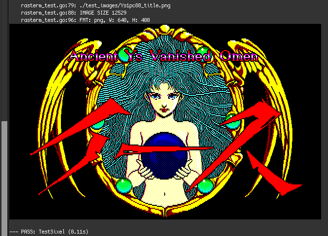

# rasterm
Encodes images to iTerm / Kitty / SIXEL (terminal) inline graphics protocols.

## Supported Image Encodings
- *WezTerm & iTerm2*: https://iterm2.com/documentation-images.html
- *Kitty*: https://sw.kovidgoyal.net/kitty/graphics-protocol.html
- *Sixel*: https://saitoha.github.io/libsixel/

## TODO
- check that mintty supports iterm/wezterm format, get mintty identifier
- perhaps query tmux directly
	TMUX=/tmp/tmux-1000/default,3218,4
- improve terminal identification
	19:VT340
	ESC[>0c = 19;344:0c
	https://invisible-island.net/xterm/ctlseqs/ctlseqs-contents.html

## TESTING
- test sixel with
	- https://github.com/liamg/aminal
	- https://domterm.org/
	- https://www.macterm.net/
- test wez/iterm img with
	- https://www.macterm.net/
  - mintty

## Cheat Sheet

- go tool pprof -http=:8080 ./name.prof
- godoc -http=:8099 -goroot="$HOME/go"
- go test -v
- go mod tidy
